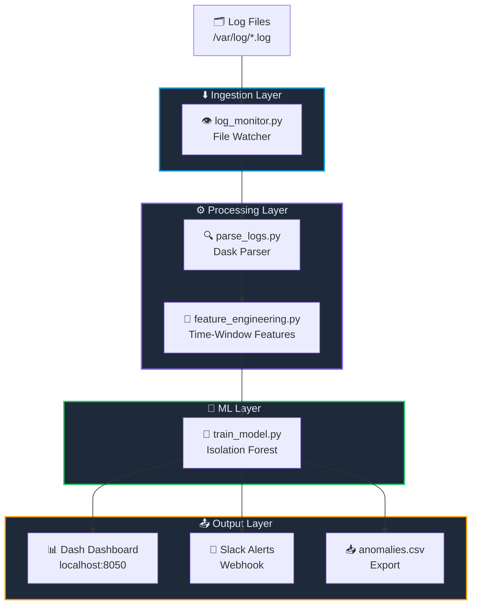
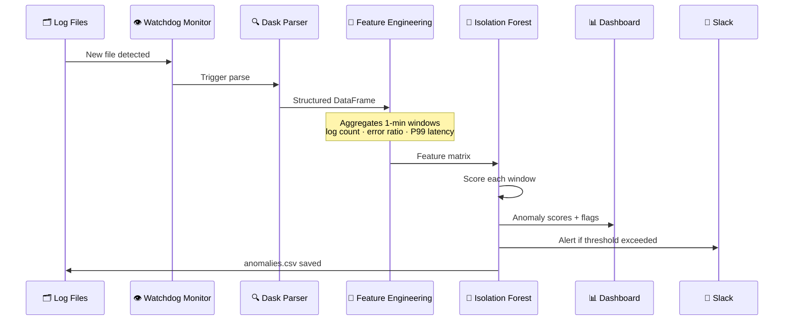
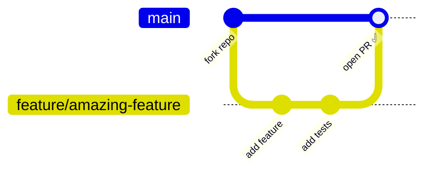
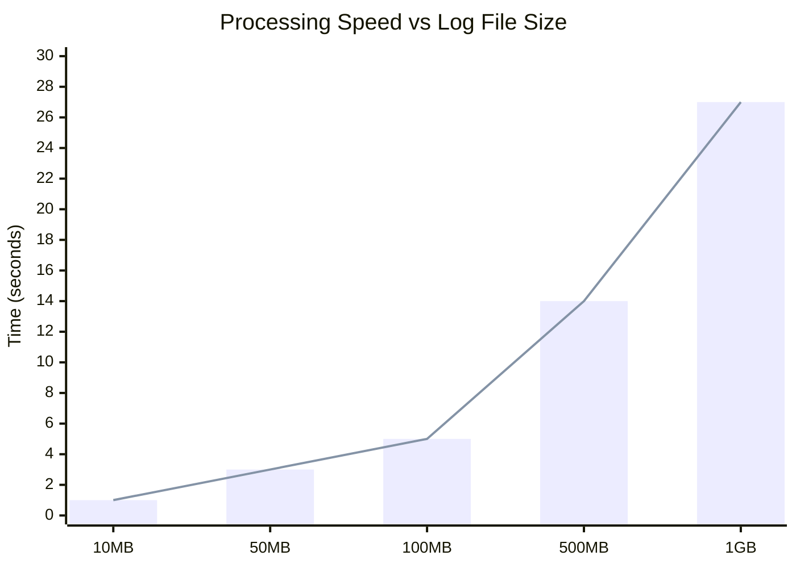

<div align="center">

<!-- Animated Banner -->


<!-- Typing animation -->
<a href="https://git.io/typing-svg">
  
</a>

<br/><br/>

<!-- Badges -->


</div>

---

## 📺 Demo Preview

<div align="center">
  
  
  > 🎬 **Live dashboard** showing real-time anomaly detection across log streams
</div>

---

## ✨ Key Features

<div align="center">

| | Feature | Description |
|---|---|---|
| ⚡ | **Scalable Parsing** | Processes huge log files with Dask — parallel, distributed, memory-efficient |
| 🧠 | **Isolation Forest** | Unsupervised ML trained on time-window features: count, error ratio, latency |
| 📊 | **Interactive Dashboard** | Dash UI with scatter plots, error timelines, service filters & raw log drill-down |
| 👁️ | **Real-Time Monitor** | Watches directories for new log files and auto-processes them as they arrive |
| 🔔 | **Slack Alerts** | Optional webhook integration to notify your team when anomalies are found |
| 📥 | **CSV Export** | Download all flagged anomalies for offline analysis or reporting |
| 🔄 | **One-Click Retrain** | Retrain the model directly from the dashboard UI — no CLI needed |

</div>

---

## 🏗️ Architecture



---

## 🔁 Data Flow



---

## 🚀 Quick Start

<details>
<summary><b>📋 Prerequisites</b></summary>

- Python **3.8+**
- Git

</details>

### 1️⃣  Clone the repository

```bash
git clone https://github.com/your-username/log-anomaly-platform.git
cd log-anomaly-platform
```

### 2️⃣  Set up a virtual environment

```bash
python -m venv venv
```

| OS | Command |
|---|---|
| 🪟 Windows | `.\venv\Scripts\Activate` |
| 🍎 macOS / 🐧 Linux | `source venv/bin/activate` |

### 3️⃣  Install dependencies

```bash
pip install -r requirements.txt
```

### 4️⃣  Generate sample logs *(optional)*

```bash
python src/generate_logs.py
```
> Creates synthetic log files in the `data/` directory for testing.

### 5️⃣  Run the full pipeline

```bash
python src/parse_logs.py          # Parse raw logs → structured format
python src/feature_engineering.py # Build time-window features
python src/train_model.py          # Train Isolation Forest & detect anomalies
```

### 6️⃣  Launch the dashboard

```bash
python src/dashboard.py
```

<div align="center">

🌐 Open **http://localhost:8050** in your browser


</div>

### 7️⃣  *(Optional)* Start real-time monitoring

```bash
python src/log_monitor.py
```

> Any new log file placed in the monitored folder will be processed automatically.

---

## 📁 Project Structure

```
log-anomaly-platform/
│
├── 📂 src/
│   ├── 🔧 generate_logs.py         ← Synthetic log generator (for testing)
│   ├── 🔍 parse_logs.py            ← Dask-powered log parser
│   ├── 🧮 feature_engineering.py   ← Creates time-window features
│   ├── 🌲 train_model.py           ← Isolation Forest trainer
│   ├── 📊 dashboard.py             ← Dash UI (localhost:8050)
│   └── 👁️ log_monitor.py          ← Real-time file watcher
│
├── 📂 data/                         ← Raw logs & intermediate CSVs
├── 📂 models/                       ← Saved model artifacts (.pkl)
├── 📄 requirements.txt
└── 📄 README.md
```

---

## 📦 Dependencies

| Package | Version | Purpose |
|---|---|---|
| `dask[complete]` | ≥ 2023.1.0 | Scalable DataFrame processing |
| `pandas` | ≥ 1.5.0 | Data manipulation |
| `scikit-learn` | ≥ 1.2.0 | Isolation Forest model |
| `dash` | ≥ 2.9.0 | Interactive web dashboard |
| `plotly` | ≥ 5.13.0 | Charts & visualisations |
| `watchdog` | ≥ 2.3.0 | File system monitoring |
| `slack-sdk` | ≥ 3.21.0 | Slack alert integration |
| `python-dotenv` | ≥ 0.21.0 | Environment variable management |

---

## ⚙️ Configuration

To enable **Slack alerts**, create a `.env` file in the project root:

```env
SLACK_WEBHOOK_URL=https://hooks.slack.com/services/your/webhook/url
```

Model parameters can be tuned in `src/train_model.py`:

```python
IsolationForest(
    contamination=0.05,   # Expected anomaly fraction (0–0.5)
    n_estimators=100,     # Number of trees
    random_state=42
)
```

---

## 🤝 Contributing

Contributions are welcome! Please follow these steps:



1. 🍴 **Fork** the repository
2. 🌿 Create a feature branch: `git checkout -b feature/amazing-feature`
3. ✅ Commit your changes: `git commit -m 'Add some amazing feature'`
4. 📤 Push to the branch: `git push origin feature/amazing-feature`
5. 🔀 Open a **Pull Request**

> Please ensure your code passes existing tests and includes appropriate new tests.

---

## 📊 Performance at a Glance



---

## 📄 License

This project is licensed under the **MIT License** — see the [LICENSE](LICENSE) file for details.

---

<div align="center">

<!-- Footer wave -->


**Made with ❤️ by [Your Name/Org]**

⭐ **Star us on GitHub** if this project helped you!

[](https://github.com/your-username/log-anomaly-platform)
[](https://github.com/your-username/log-anomaly-platform/fork)
[](https://github.com/your-username/log-anomaly-platform)

</div>

